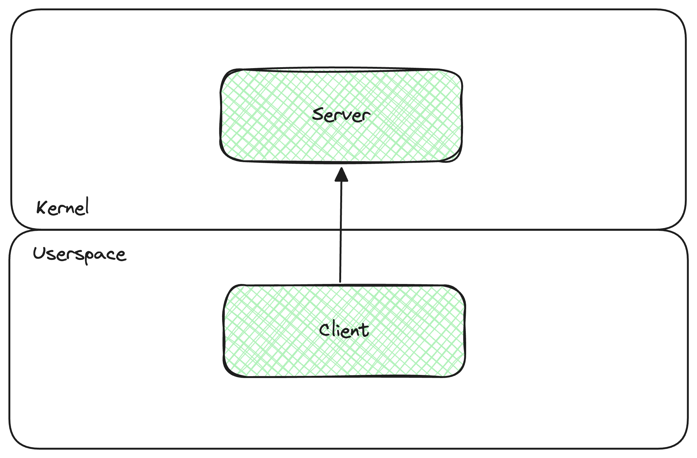
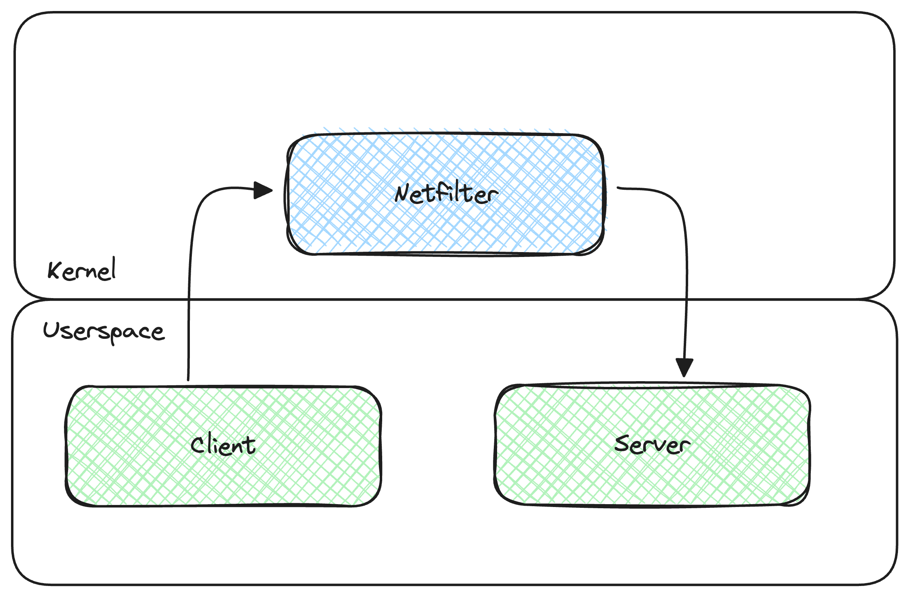

# pbtools_lkm

[Google Protocol Buffers][protocol-buffers] implementation that runs as a linux kernel module.

> This is a university project, **DO NOT USE IT IN PROD** as is.

The project is based (and is a fork of) [eerimoq/pbtools][pbtools] and shares its limitations:

- Options, services (gRPC) and reserved fields are ignored.
- Public imports are not implemented.

## Example Usage
Here it is explained how to initialize, compile and load a new module

### Requirements
- python3
- python3-env
- python3-pip
- make
- gcc
- Linux os
- Linux build requirements

### LKM Stub
In this example we use the simple proto-file [hello_world.proto](examples/common/hello_world/proto/hello_world.proto)

```proto
syntax = "proto3";

package hello_world;

message Foo {
    int32 bar = 1;
}
```
1. Create venv
    ```shell
    make requirements
    ```
2. Generate LKM stub from the proto-file. Replace `<module-type>` and `<output-folder>` with your choices.
    ```shell
    export PYTHONPATH=$(pwd)
    ./.venv/bin/python3 -m pbtools_lkm generate_lkm_source -T <module-type> -o <output-folder> examples/common/hello_world/proto/hello_world.proto
    ```

### Compile the module
1. Enter the created folder
    ```shell
    cd <output-folder>
    ```
2. Open `main.c` and add your code inside the function where you find this comment
   ```c
    /*
     * TODO: Place your code here
     */
   ```
3. Compile, install and load the module
    ```shell
    make
    ```
4. See the logs
   ```shell
   dmesg
   ```
5. (optional) Unload the module
   ```shell
   make unload
   ```

## Output Module Types
> Inside the [Examples](examples/README.md) folder there are some examples on how this project can be used.

This project can output two types of module stubs.
They both assume that the protobuf messages are prepended with the encoded message size in a 32 bit format.

Both module types will load the encoded protobuf message into this struct:
```C
typedef struct {
    int size;
    uint8_t encoded[BUFFER_SIZE];
} message;
```
Where size contains the size of the encoded protobuf and encoded is a fixed-size buffer that holds the encoded data.

> The modules do not use dynamic memory allocation

### [UDP Sockets](examples/socket_udp/README.md)

Here an UDP socket is opened inside the LKM to receive a protobuf message.

Inside the `main.c` folder you will find that the module opens a UDP socket and wait for a single packet.

The message is placed into the message structure and all the code to dela with the decode should be placed inside this function:
```C
static void decode(message *data)
{
    /*
     * TODO: Place your code here
     */
     
    pr_info("Data.encoded:\n");
    print_hex(data->encoded, strlen(data->encoded));

    pr_info("To implement");
}
```
Some placeholder code is placed for debug reason: The code just print the received raw data in hex format.


### [Netfilter](examples/netfilter/README.md)

Here the module is used to filter tcp packets between two applications and apply some drop logics based on the protobuf content.

Inside the `main.c` file you will find that the module register a netfilter hook function (`hook_func`) that filter **TCP** packets sent to **localhost:60001**.

The `hook_func` check the packet  port, address, protocol (TCP only) and flags (only psh = 1), if the packet does not match our request we ignore it.

Then `hook_func` calls the `handle_tcp_payload` function that, after checking if the payload length is > 0, takes the `sk_buff` struct and creates the `message` struct.

Finally `handle_tcp_payload` calls `process_message`, here yous should decode your message and add the filter logic:
```C
unsigned int process_message(message *data)
{

    /*
     * TODO: Place your code here
     */

    return NF_ACCEPT;
}
```
> The function should return an int corresponding to a netfilter response es: NF_ACCEPT, NF_DROP.

## Float support
Since floats are not commonly used inside the kernel some special attention have to be putted when the module need to make float operations:

This project changed the original pbtools floats types:

| pbtools | pbtools_lkm |
|---------|-------------|
| float   | uint32_t    |
| double  | uint64_t    |

This way the FPU do not have to be enabled if the floats are not processed inside the module.

### Instructions
> This instruction are intended for x86_64 platform (tested on EPYC processor)

> You can find a working example [here](examples/netfilter/floats/module/main.c)
1. Include the floats header into `main.c`
   ```C
   #include <asm/uaccess.h>
   #include <asm/fpu/api.h>
   ```
2. Keep all the code that handle the float operation tight together
3. Surround this part of the code with the fpu enable/disable:
   ```C
   // declare var to store irq flags
   unsigned long flags;
   
   // Save the current FPU state
   local_irq_save(flags);
   kernel_fpu_begin();
   
   /*
    * Put your float code here
    */
    
   // Restore the saved FPU state
   kernel_fpu_end();
   local_irq_restore(flags);
   ```
4. To convert the variables from uintXX_t to float/double you can use this method:
   ```C
   uint32_t my_var_uint;
   float my_var_f;
   
   union FloatConverter {
      uint32_t raw_value;
      float float_value;
   };
   
   union FloatConverter converter;
   
   // assign to the variable raw_value the uint32_t value
   converter.raw_value = my_var_uint;
   
   // get float
   my_var_f = converter.float_value;
   ```
5. Add this flags to your makefile
   ```makefile
   EXTRA_CFLAGS   	+= -msoft-float -msse -msse2 -msse3 -msse4
   ```
   > This part is highly architecture dependant see [here](https://stackoverflow.com/questions/1556142/sse-register-return-with-sse-disabled) for more details

## Roadmap
- [ ] Support for ebpf filter generation

## Special thanks to
- [eerimoq/pbtools][pbtools] for the library I used for the port
- [gschwaer/vscode-kernel-module][vscode-kernel-module] for the vscode setup
- [phip1611/cmake-kernel-module][cmake-kernel-module] for the clion setup
- [Linux-Kernel-Programming-Part-2][LKP-2] for the module Makefile template
- [linux-kernel-labs][linux-kernel-labs] for the guides on how to use sockets inside the kernel


[protocol-buffers]: https://developers.google.com/protocol-buffers
[proto3]: https://developers.google.com/protocol-buffers/docs/proto3
[pbtools]: https://github.com/eerimoq/pbtools
[vscode-kernel-module]: https://github.com/gschwaer/vscode-kernel-module
[cmake-kernel-module]: https://gitlab.com/phip1611/cmake-kernel-module
[linux-kernel-labs]: https://linux-kernel-labs.github.io/refs/heads/master/labs/networking.html
[LKP-2]: https://github.com/PacktPublishing/Linux-Kernel-Programming-Part-2